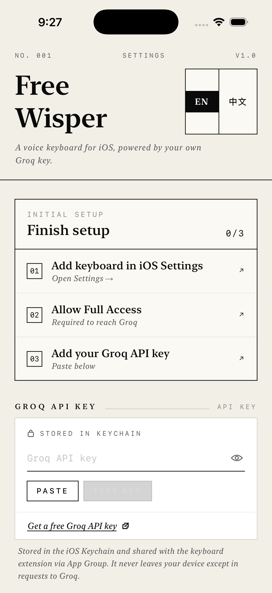
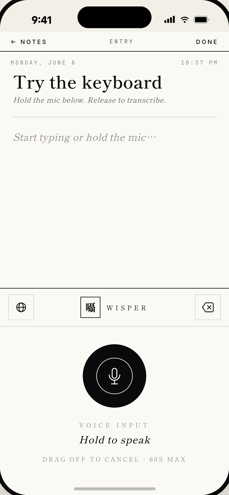

# Free Wisper

**A privacy-first voice keyboard for iOS, powered by your own [Groq](https://groq.com) API key.**

[](LICENSE)


Free Wisper is a system-wide dictation keyboard. Hold the mic, speak, and your words are
transcribed by Groq's Whisper models and dropped straight into whatever app you're typing in —
optionally cleaned up by an LLM first. There are **no accounts, no servers, and no tracking**:
your audio goes directly from your device to Groq using *your* key, and nowhere else.

<p align="center">
  
  &nbsp;&nbsp;
  
</p>
<p align="center"><sub>The container app (left) and the voice keyboard in action (right).</sub></p>

## Features

| | Feature | What it does |
|:--:|---|---|
| 🎙️ | **Hold-to-talk keyboard** | A custom keyboard extension — press and hold the mic, speak, release to transcribe. Works in any app. |
| ⚡ | **Groq Whisper transcription** | Choose **Whisper Large v3** (high accuracy) or **Whisper Large v3 Turbo** (216× real-time). |
| ✨ | **Optional AI cleanup** | Refine the transcript with an LLM (**GPT-OSS 120B / 20B** on Groq) at three intensities — **Light** (punctuation & fillers), **Standard** (smooth grammar), **Email** (full rewrite). |
| 🌐 | **Bilingual** | Full **English / 简体中文** interface, toggled in-app. |
| 📰 | **Editorial design** | An ink-on-paper, museum-catalog aesthetic with serif type and hairline borders. |
| 🔒 | **Private by design** | No accounts, no servers, no analytics. |

## Privacy

- Your Groq API key is stored in the **iOS Keychain** and shared with the keyboard extension via a
  Keychain access group. In Release builds it is **never** written to plaintext or `UserDefaults`.
- Recorded audio is written to a temporary file, sent directly to Groq, and deleted as soon as the
  text returns. The transcript lives only in memory until it's inserted at your cursor.
- The keyboard requires **Full Access** for one reason: iOS keyboard extensions cannot make network
  requests without it, and reaching Groq requires the network. No data is sent anywhere but Groq.
- Review [Groq's privacy policy](https://groq.com/privacy-policy/) to understand how they handle data
  sent to their API.

## How it works

Three modules make up the project:

| Module | Role |
|---|---|
| `FreeWisper` | The container app — onboarding, API-key entry, and all settings. |
| `FreeWisperKeyboard` | The keyboard extension — the mic UI and the record → transcribe → (clean up) → insert state machine. |
| `Shared` | Code linked into both — theme, models, Keychain/App-Group storage, and the Groq networking client. |

The app and extension communicate through an **App Group** (`group.com.freewisper.shared`) and a shared
**Keychain access group**. `GroqClient` talks to Groq's `/audio/transcriptions` and `/chat/completions`
endpoints. There are **no third-party dependencies** — deliberately, to keep the extension within its
tight memory budget.

## Getting started

### Requirements

- macOS with **Xcode 16+**
- [**xcodegen**](https://github.com/yonaskolb/XcodeGen) — `brew install xcodegen`
- A free **Groq API key** — [console.groq.com/keys](https://console.groq.com/keys)
- An Apple Developer account to run on a physical device (App Groups and keyboard Full Access require
  provisioning; the iOS Simulator works without one)

### Build

```bash
git clone https://github.com/xchkcode0803/free-wisper.git
cd free-wisper
xcodegen generate          # generates FreeWisper.xcodeproj from project.yml
open FreeWisper.xcodeproj
```

Build & run the `FreeWisper` scheme, then set it up:

1. In the app, paste your **Groq API key**.
2. Add the keyboard: open **Settings → General → Keyboard → Keyboards → Add New Keyboard…** and choose **Free Wisper**.
3. Back in that list, tap **Free Wisper** and turn on **Allow Full Access** — this is required so the keyboard can reach Groq over the network.

Now switch to the Free Wisper keyboard (tap the 🌐 globe in any text field) and hold the mic to dictate.

> [!IMPORTANT]
> **Running on a real device (or forking)?** The bundle IDs, App Group, and Keychain group in this
> repo are registered to the original author. Change them to values registered to *your* team before
> building on-device — in `project.yml` and both `*.entitlements` files:
> - bundle IDs: `com.freewisper.app` / `com.freewisper.app.keyboard`
> - App Group: `group.com.freewisper.shared`
> - Keychain access group: `com.freewisper.apikey`
>
> Set your signing **Team** in Xcode (Automatic signing is enabled).

## Project structure

```
free-wisper/
├── project.yml                 # xcodegen project definition (source of truth)
├── FreeWisper/                 # Container app target
│   ├── App/                    # @main entry point
│   ├── Settings/               # Settings screen, view model
│   │   ├── Components/         # Reusable SwiftUI primitives
│   │   └── Sections/           # Setup banner, API key, models, cleanup, footer, about
│   └── Resources/              # Info.plist, assets, PrivacyInfo
├── FreeWisperKeyboard/         # Keyboard extension target
│   ├── KeyboardViewController.swift
│   ├── VoiceKeyboard*.swift    # UI + state machine
│   ├── AudioRecorder.swift
│   └── Components/             # Mic button, status label, corner buttons
├── Shared/                     # Linked into both targets
│   ├── Theme/                  # Colors, typography, localization, icons
│   ├── Models/                 # Transcription/cleanup model + style enums
│   ├── Storage/                # Keychain + App-Group defaults
│   └── Networking/             # GroqClient + errors
├── FreeWisperUITests/          # XCUITest suite
├── design-specs/               # React/JSX design prototypes (reference only)
└── screenshots/                # UI screenshots
```

## Contributing

- The Xcode project is **generated** — edit `project.yml`, not the `.xcodeproj`, then run
  `xcodegen generate`. The `.xcodeproj` is gitignored.
- UI is SwiftUI throughout; user-facing strings live in `Shared/Theme/Localization.swift` (keep
  English and 简体中文 in sync).
- UI tests are in `FreeWisperUITests`; run them via the `FreeWisper` scheme.

## Acknowledgments

- [Groq](https://groq.com) for fast Whisper transcription and open-model inference.
- Cleanup-prompt design informed by [OpenWhispr](https://github.com/OpenWhispr/openwhispr).

## License

[MIT](LICENSE) © 2026 Matt Xue
